# 智慧公安管理系统

<p align="center">
  
  
  
  
  
</p>

---

## 项目简介

**智慧公安管理系统**是一款面向公安机关的智能化综合管理平台，深度融合人工智能技术与公安业务场景，为执法人员提供智能化的辅助决策支持。系统涵盖执法办案、刑侦研判、治安管理、智能助手等核心业务模块，通过 AI 赋能实现案件智能分析、线索研判、风险评估等功能，大幅提升公安工作效率与精准度。

---

## 系统架构

```
┌─────────────────────────────────────────────────────────────────────────┐
│                         前端应用层 (Vue 3 + Ant Design Vue)               │
│  ┌─────────┐ ┌─────────┐ ┌─────────┐ ┌─────────┐ ┌─────────┐ ┌─────────┐│
│  │ 系统管理 │ │ 执法办案 │ │ 智能助手 │ │ 智能导航 │ │ 刑侦研判 │ │ 治安管理 ││
│  └─────────┘ └─────────┘ └─────────┘ └─────────┘ └─────────┘ └─────────┘│
├─────────────────────────────────────────────────────────────────────────┤
│                         后端服务层 (Spring Boot 3.4)                      │
│  ┌─────────────────────────────────────────────────────────────────┐   │
│  │                    Spring Security + JWT 认证授权                 │   │
│  ├─────────────────────────────────────────────────────────────────┤   │
│  │     Controller     │      Service      │      Mapper (MyBatis)   │   │
│  └─────────────────────────────────────────────────────────────────┘   │
├─────────────────────────────────────────────────────────────────────────┤
│                           数据存储层                                     │
│  ┌─────────────────────┐          ┌─────────────────────┐              │
│  │    PostgreSQL 14+   │          │      Redis (可选)    │              │
│  │   业务数据持久化      │          │   缓存 & 会话管理     │              │
│  └─────────────────────┘          └─────────────────────┘              │
├─────────────────────────────────────────────────────────────────────────┤
│                          AI 能力层                                       │
│  ┌─────────────────────────────────────────────────────────────────┐   │
│  │              大模型服务 (OpenAI 兼容 API / Ollama)                 │   │
│  │    智能对话 │ 文档解析 │ 意图识别 │ RAG知识库 │ 案件分析           │   │
│  └─────────────────────────────────────────────────────────────────┘   │
└─────────────────────────────────────────────────────────────────────────┘
```

---

## 功能模块

### 1. 系统管理

提供完善的系统基础管理能力，支持多机构、多角色的精细化权限控制。

| 功能 | 说明 |
|------|------|
| 用户管理 | 用户增删改查、密码重置、状态管理 |
| 角色管理 | 角色定义、菜单权限配置、API权限分配 |
| 机构管理 | 树形机构结构、层级权限控制 |
| 菜单管理 | 动态菜单配置、路由权限绑定 |

- 用户管理

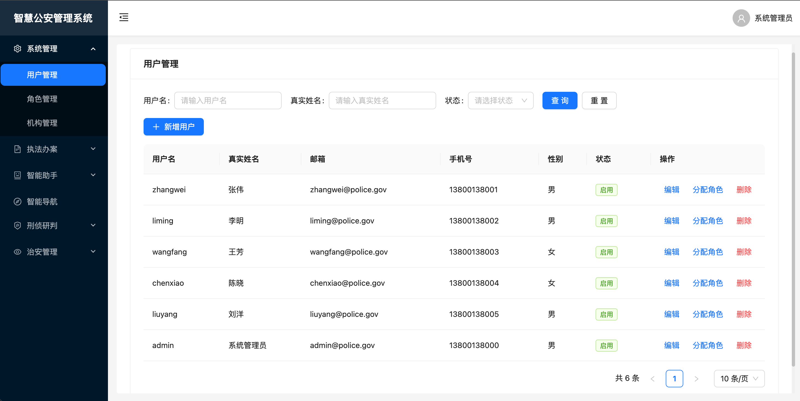

- 角色管理
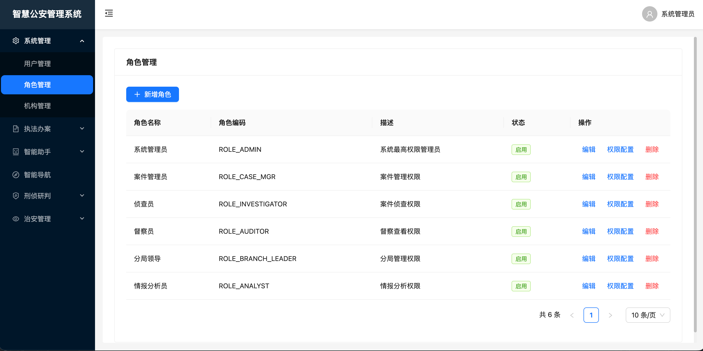
- 机构管理
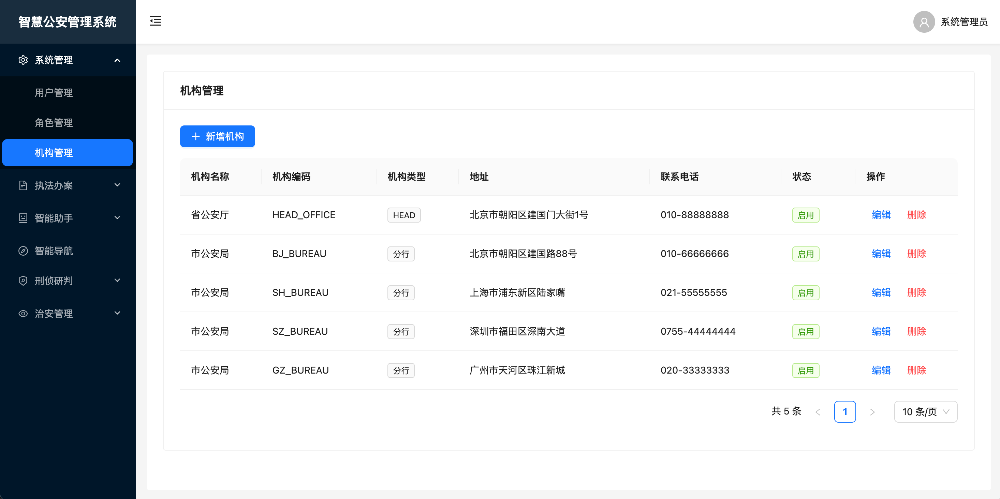

---

### 2. 执法办案

**智能文书处理系统** —— 基于 AI 的法律文书智能识别与信息提取

| 功能 | 说明 |
|------|------|
| 文书上传 | 支持 PDF、Word 等多种格式法律文书上传 |
| 智能提取 | AI 自动识别文书类型，提取案号、当事人、涉案金额等关键信息 |
| 表单填充 | 提取结果自动填充表单，人工确认后入库 |
| 文书管理 | 文书分类管理、全文检索、导出打印 |

**核心价值：**
- 🚀 **效率提升**：文书信息录入时间缩短 80%
- 🎯 **准确率高**：AI 提取准确率达 95% 以上
- 📊 **规范化**：统一文书数据格式，便于后续分析


- 案件信息填报
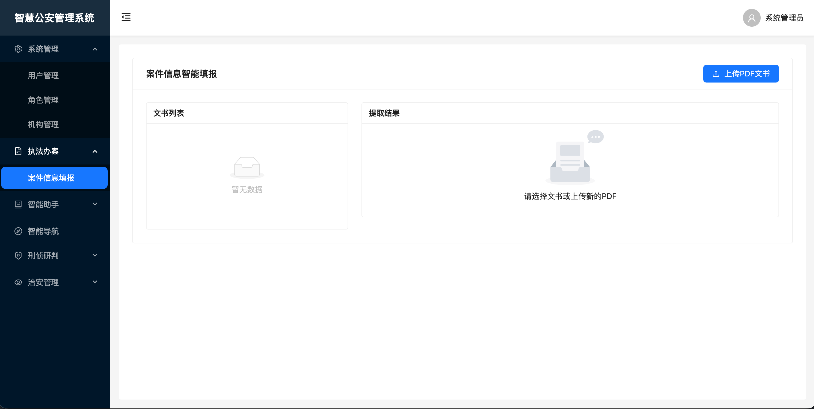
- 提取结果截图
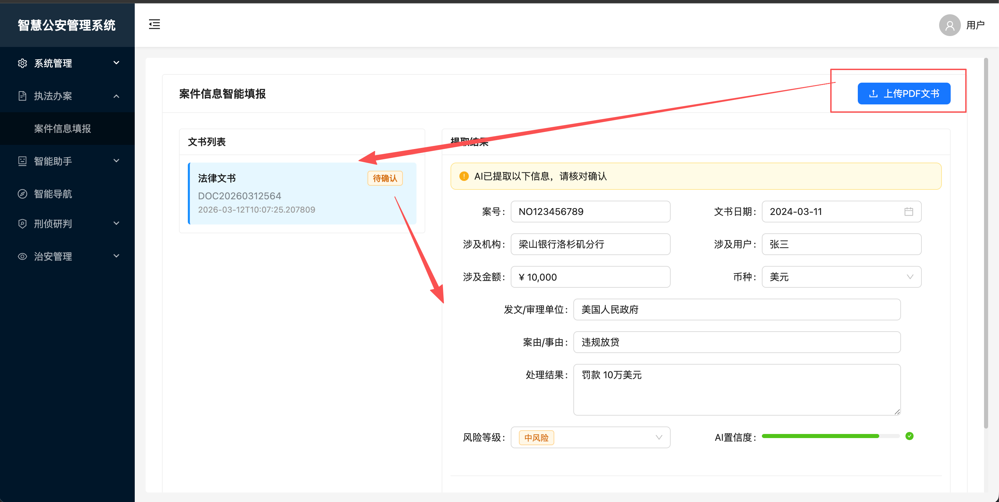
- 可复核确认后保存
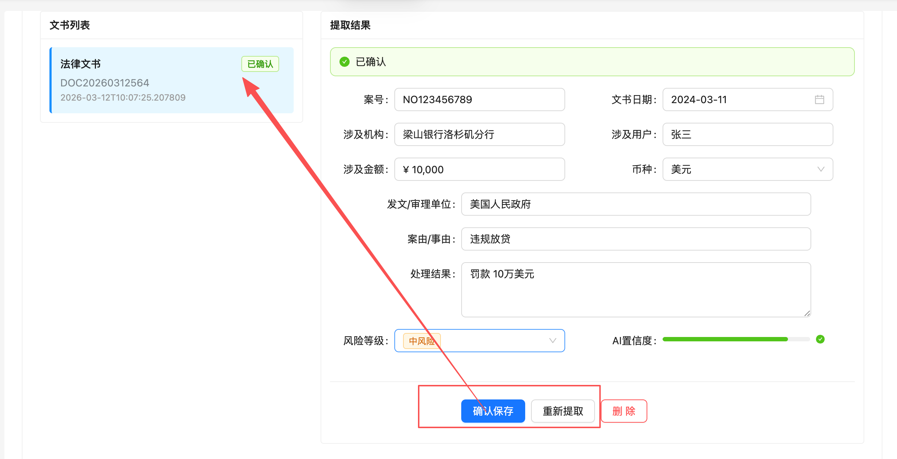
---

### 3. 智能助手

**RAG 知识库问答系统** —— 构建专属业务知识库，实现智能问答

| 功能 | 说明 |
|------|------|
| 知识库管理 | 创建多类型知识库（法律法规、案件案例、业务规范等） |
| 文档管理 | 上传业务文档，支持 PDF、Word、TXT 格式 |
| 智能分块 | 文档自动切分，向量化存储 |
| 智能问答 | 基于知识库的精准问答，支持引用溯源 |

**技术亮点：**
- 🔍 **向量检索**：基于语义相似度的智能检索
- 📚 **RAG 架构**：检索增强生成，答案更精准
- 🔗 **引用溯源**：答案标注来源文档，可追溯可信


- 知识库管理
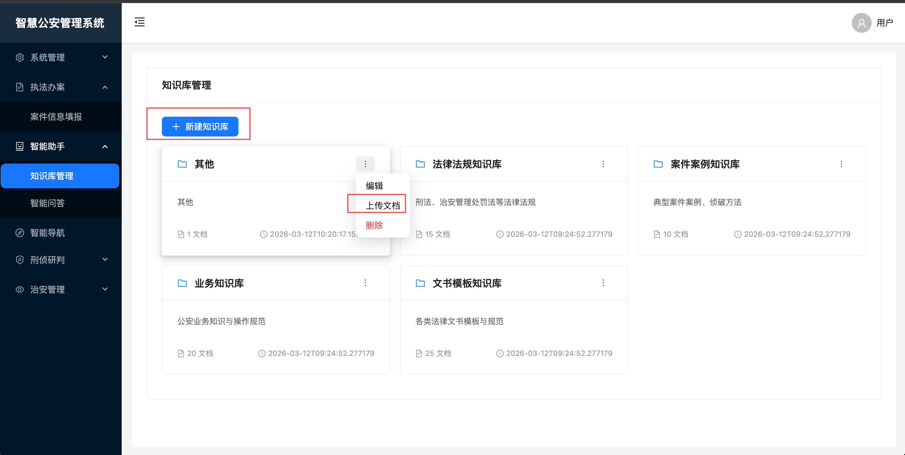
- 智能问答（包含引用来源）
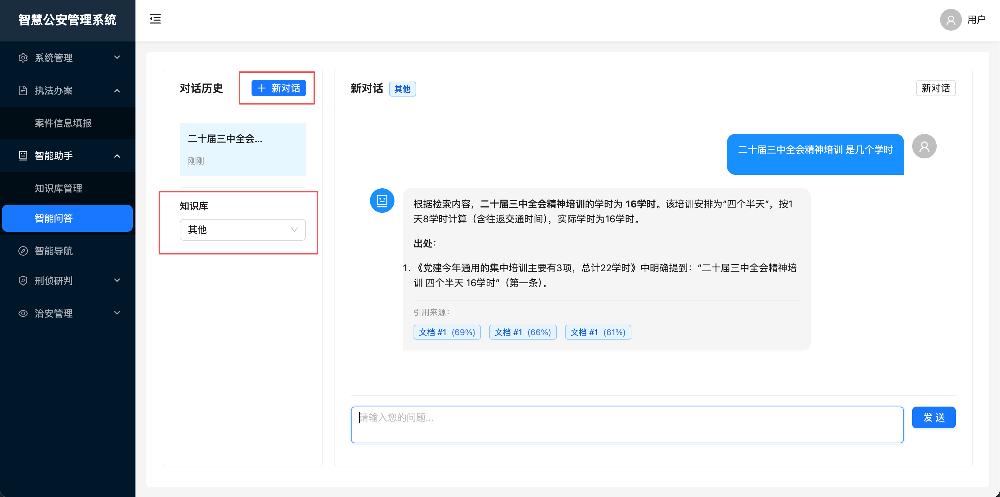

---

### 4. 智能导航

**自然语言意图识别与智能路由** —— 用自然语言快速定位功能

| 功能 | 说明 |
|------|------|
| 意图识别 | 理解用户自然语言输入，识别操作意图 |
| 智能路由 | 根据意图自动跳转目标功能页面 |
| 权限校验 | 跳转前校验用户访问权限 |
| 历史记录 | 记录导航历史，优化识别准确率 |

**使用示例：**
```
用户输入："查看重点人员" → 自动跳转【重点人员管理】
用户输入："上传案件材料" → 自动跳转【案件信息填报】
用户输入："分析可疑交易" → 自动跳转【资金流水分析】
```

> 📷 **智能导航截图位置**
> - 导航入口界面截图
> - 意图识别与跳转演示截图

---

### 5. 刑侦研判

**智能案件分析与研判系统** —— AI 赋能刑侦工作全流程

| 功能 | 说明 |
|------|------|
| 重点人员管理 | 人员画像、风险等级标注、关注名单管理 |
| 资金流水分析 | 交易记录管理、可疑交易标记、资金流向分析 |
| 案件智能分析 | AI 分析案件疑点、生成分析报告、侦查建议 |

**AI 分析能力：**
- 📊 **风险研判**：自动评估人员风险等级
- 🔗 **关联分析**：识别交易对手、关联人员
- 📝 **报告生成**：自动生成案件分析报告
- 💡 **侦查建议**：提供后续侦查方向建议

- 重点人员列表
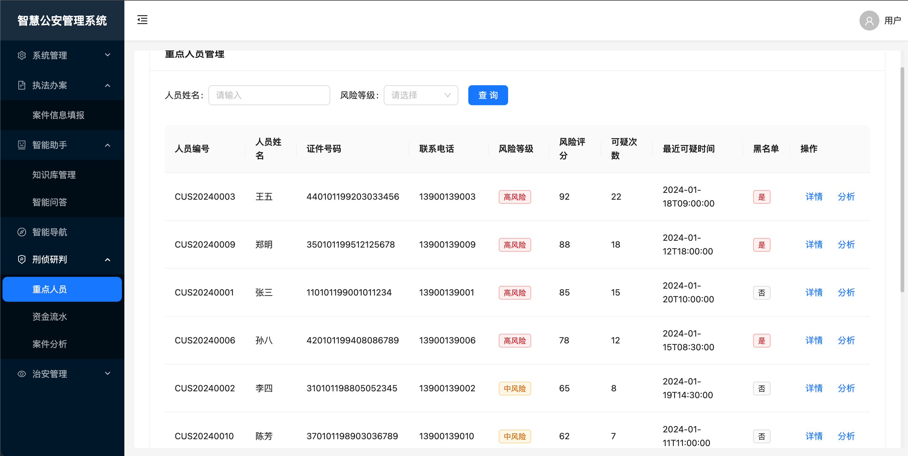
- 重点人员-详情
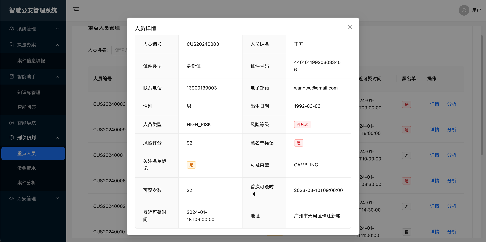
- 资金流水（数据可从其他地方同步）
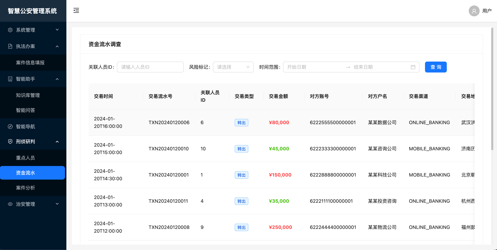
- AI案件分析
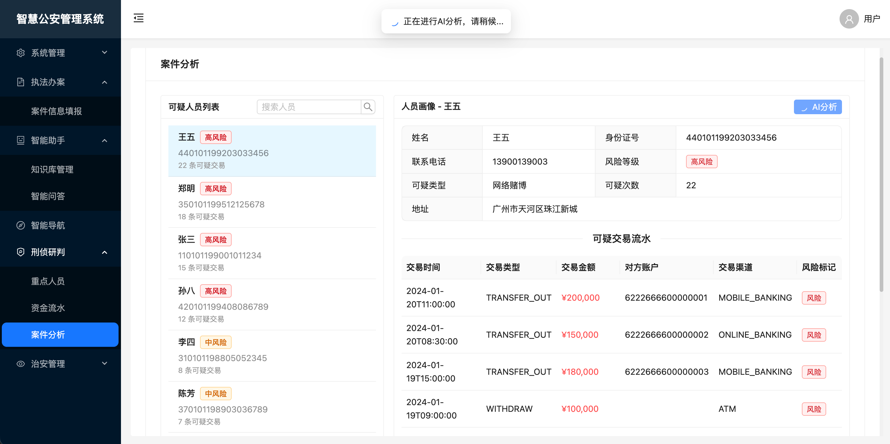
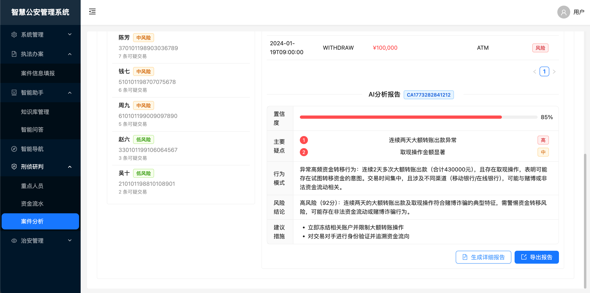
详细报告
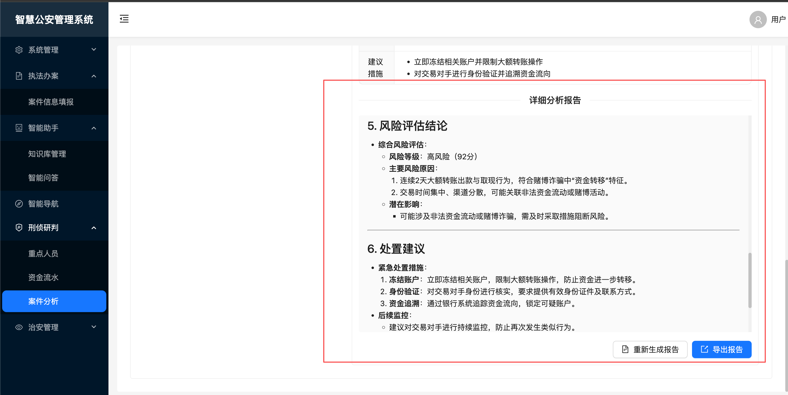
---

### 6. 治安管理

**人员核查与线索管理系统** —— 治安管控智能化

#### 人员核查
| 功能 | 说明 |
|------|------|
| 核查流程管理 | 支持加强核查、标准核查、简化核查三种类型 |
| AI 辅助分析 | 自动分析人员背景、识别风险因素、生成核查建议 |
| 历史记录管理 | 支持查看历史分析结果，可重新生成分析 |
| 风险评估展示 | 直观展示风险等级、风险因素、可疑点 |

#### 线索管理
| 功能 | 说明 |
|------|------|
| 线索录入 | 录入可疑线索信息，关联人员、交易数据 |
| AI 智能研判 | 自动分析线索可信度、紧急程度、风险等级 |
| 犯罪模式识别 | 识别犯罪类型、分析作案手法 |
| 报告生成 | 生成详细线索分析报告，支持导出 |


- 人员核查列表
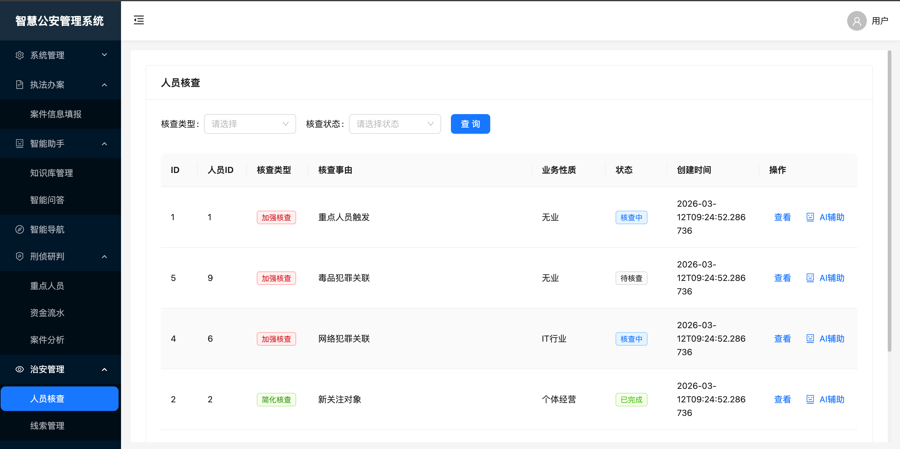
- 核查详情
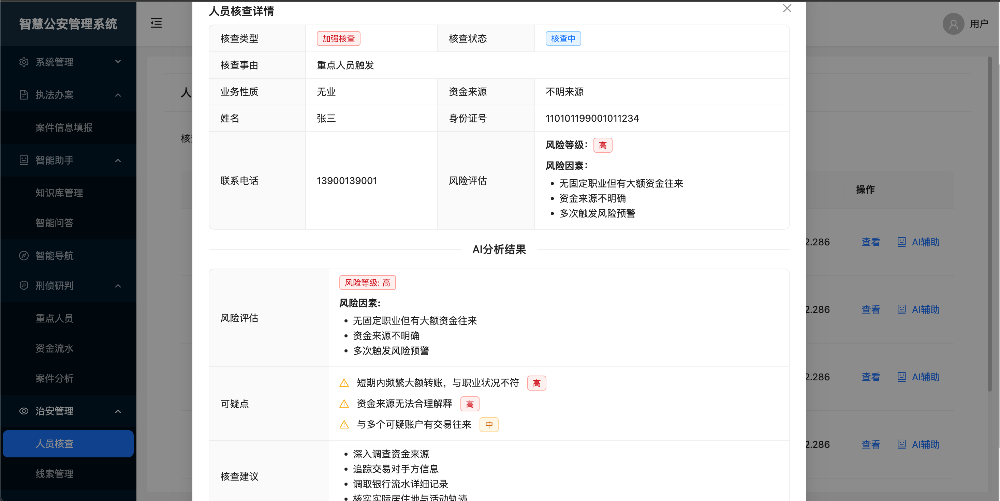
- AI 辅助分析
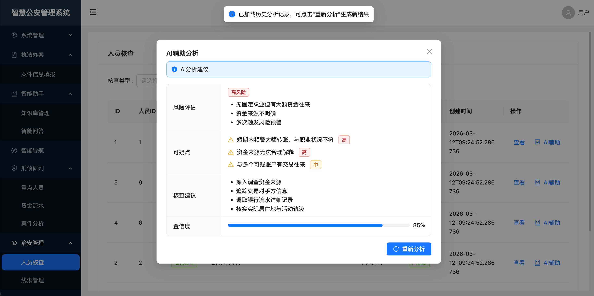
- 线索管理
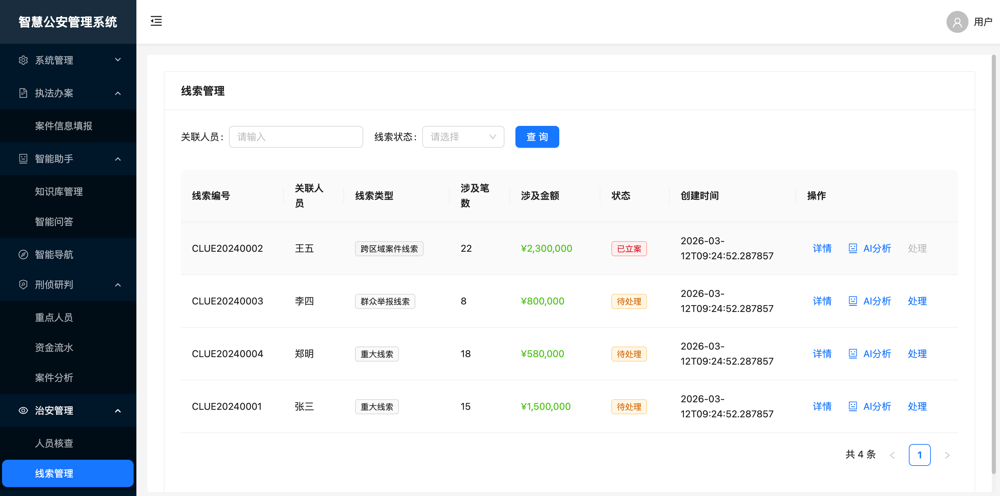
- 线索分析详情
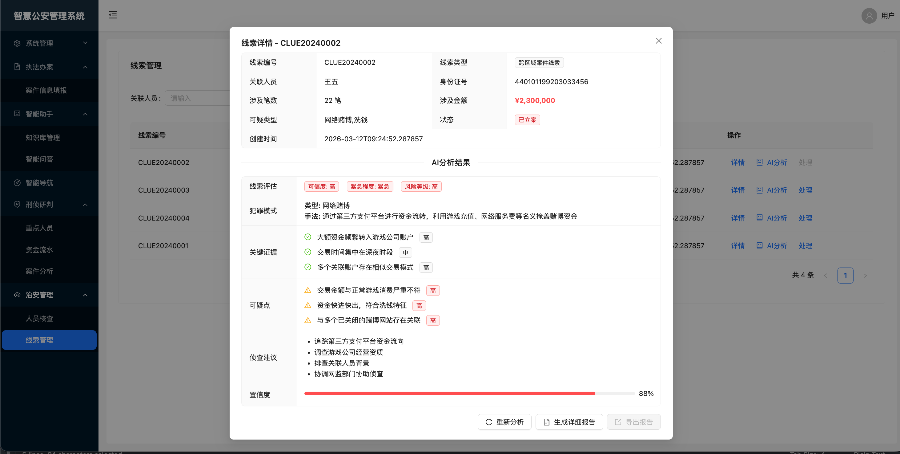
- 详细分析报告(可导出)
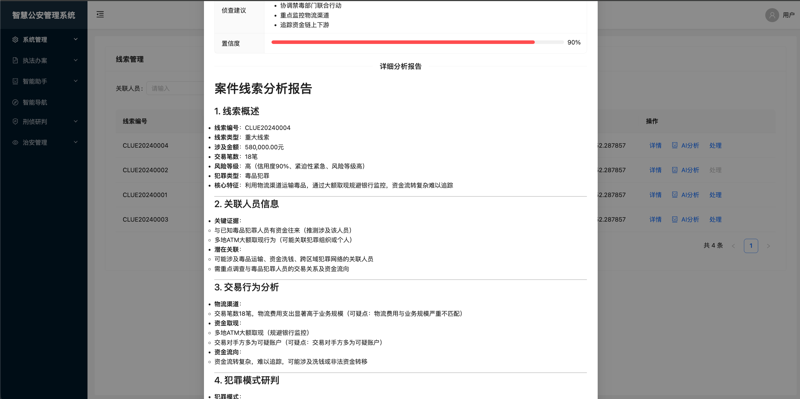
- 处理案件
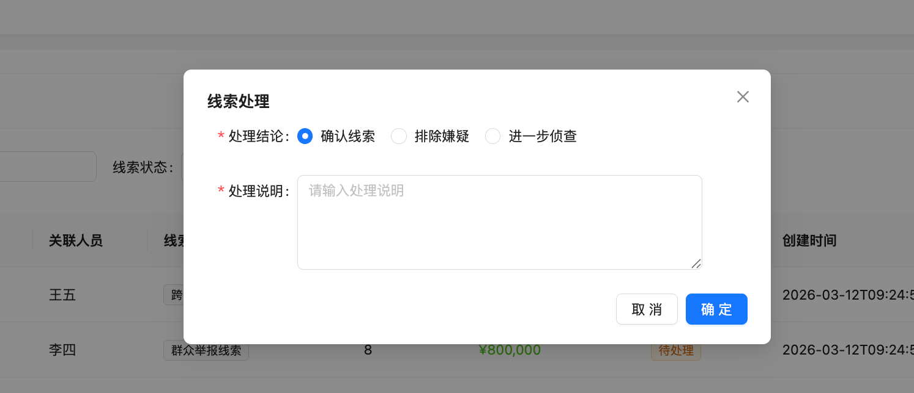

---

## 技术栈

### 后端技术

| 技术 | 版本 | 说明 |
|------|------|------|
| Java | 21 | 编程语言 |
| Spring Boot | 3.4.2 | 基础框架 |
| Spring Security | - | 安全框架 |
| MyBatis-Plus | 3.5.5 | ORM 框架 |
| PostgreSQL | 14+ | 关系数据库 |
| Redis | 7+ | 缓存/会话 |
| JWT | 0.12.6 | 认证令牌 |
| SpringDoc | 2.8.4 | API 文档 |
| FastJSON2 | 2.0.43 | JSON 处理 |
| Apache PDFBox | 3.0.1 | PDF 解析 |
| Apache POI | 5.2.5 | Office 文档处理 |

### 前端技术

| 技术 | 版本 | 说明 |
|------|------|------|
| Vue | 3.5 | 前端框架 |
| Vite | 6.x | 构建工具 |
| Pinia | 2.x | 状态管理 |
| Ant Design Vue | 4.x | UI 组件库 |
| Axios | 1.x | HTTP 客户端 |
| Marked | - | Markdown 渲染 |

### AI 集成

| 技术 | 说明 |
|------|------|
| OpenAI 兼容 API | 支持 OpenAI、Azure、国内大模型 API |
| Ollama | 本地大模型部署方案 |
| 向量数据库 | 文档向量化存储（可选 pgvector） |

---

## 快速开始

### 环境要求

| 依赖 | 版本要求 |
|------|----------|
| JDK | 21+ |
| Node.js | 18+ |
| PostgreSQL | 14+ |
| Maven | 3.8+ |
| Redis | 7+ (可选) |

### 数据库初始化

```bash
# 1. 创建数据库
gongan_management

# 2. 执行初始化脚本
init.sql

# 3. 导入测试数据
data.sql
```

### 后端启动

```bash
cd gongan-backend

# 方式一：Maven 启动（开发模式）
mvn spring-boot:run

# 方式二：打包运行（生产模式）
mvn clean package -DskipTests
java -jar target/gongan-backend-1.0.0.jar
```

### 前端启动

```bash
cd gongan-frontend

# 安装依赖
npm install

# 开发模式
npm run dev

# 生产构建
npm run build
```

### 访问系统

| 地址 | 说明 |
|------|------|
| http://localhost:5173 | 前端页面 |
| http://localhost:8080/api | 后端 API |
| http://localhost:8080/api/swagger-ui.html | API 文档 |

**默认账号：** `admin` / `123456`

---

## 配置说明

### 后端配置 (application.yml)

```yaml
# 服务器配置
server:
  port: 8080
  servlet:
    context-path: /api

# 数据库配置
spring:
  datasource:
    url: jdbc:postgresql://localhost:5432/gongan_management
    username: your_username
    password: your_password

  # Redis 配置（可选）
  data:
    redis:
      host: localhost
      port: 6379

# JWT 配置
jwt:
  secret: your-jwt-secret-key-must-be-at-least-256-bits-long
  expiration: 86400000  # 24小时

# 大模型配置
llm:
  api-url: http://localhost:11434/v1    # Ollama 本地服务
  # api-url: https://api.openai.com/v1  # 或 OpenAI API
  api-key: your-api-key
  model: qwen2.5:7b                      # 模型名称
  max-tokens: 4096
  temperature: 0.7
```

### 大模型服务配置

#### 方式一：使用 Ollama（推荐本地开发）

```bash
# 安装 Ollama
访问ollama官网:https://ollama.com/ 进行安装

# 下载模型
ollama pull qwen3-embedding:0.6b
ollama pull qwen2.5:7b

# 修改最大模型加载为2，或者其他值
export OLLAMA_MAX_LOADED_MODELS=2

# 启动服务
ollama serve
```

#### 方式二：使用 OpenAI 兼容 API

```yaml
llm:
  api-url: https://api.openai.com/v1
  api-key: sk-xxxxx
  model: gpt-4o-mini
```

---

## 项目结构

```
Intelligent-Policing/
├── database/                          # 数据库脚本
│   ├── init.sql                       # 表结构定义
│   └── data.sql                       # 测试数据
│
├── gongan-backend/                    # 后端项目
│   ├── src/main/java/com/gongan/
│   │   ├── GonganManagementApplication.java
│   │   ├── config/                    # 配置类
│   │   │   ├── SecurityConfig.java    # 安全配置
│   │   │   ├── JwtProperties.java     # JWT 配置
│   │   │   └── MybatisPlusConfig.java # MyBatis 配置
│   │   ├── controller/                # 控制器层
│   │   ├── service/                   # 服务层
│   │   │   └── impl/                  # 服务实现
│   │   ├── mapper/                    # MyBatis Mapper
│   │   ├── entity/                    # 实体类
│   │   ├── dto/                       # 数据传输对象
│   │   ├── enums/                     # 枚举定义
│   │   ├── exception/                 # 异常处理
│   │   ├── filter/                    # 过滤器
│   │   ├── aspect/                    # 切面
│   │   └── util/                      # 工具类
│   │       ├── JwtUtils.java          # JWT 工具
│   │       └── LLMClient.java         # 大模型客户端
│   └── src/main/resources/
│       ├── mapper/                    # Mapper XML
│       └── application.yml            # 配置文件
│
├── gongan-frontend/                   # 前端项目
│   ├── src/
│   │   ├── main.js                    # 入口文件
│   │   ├── App.vue                    # 根组件
│   │   ├── api/                       # API 接口
│   │   ├── views/                     # 页面组件
│   │   │   ├── login/                 # 登录页
│   │   │   ├── layout/                # 布局组件
│   │   │   ├── system/                # 系统管理
│   │   │   ├── ops-risk/              # 执法办案
│   │   │   ├── ai-assistant/          # 智能助手
│   │   │   ├── smart-nav/             # 智能导航
│   │   │   ├── anti-fraud/            # 刑侦研判
│   │   │   └── aml/                   # 治安管理
│   │   ├── components/                # 公共组件
│   │   ├── router/                    # 路由配置
│   │   ├── store/                     # 状态管理
│   │   ├── utils/                     # 工具函数
│   │   └── assets/                    # 静态资源
│   ├── package.json
│   └── vite.config.js
│
└── uploads/                           # 上传文件目录
    ├── knowledge/                     # 知识库文档
    └── pdf/                           # PDF 文档
```

---

## API 文档

启动后端服务后访问：

| 文档类型 | 地址 |
|----------|------|
| Swagger UI | http://localhost:8080/api/swagger-ui.html |
| OpenAPI JSON | http://localhost:8080/api/v3/api-docs |

---

## 安全说明

- **身份认证**：基于 JWT 的无状态认证机制
- **权限控制**：RBAC 角色权限模型，支持菜单级和 API 级权限
- **密码加密**：BCrypt 单向加密存储
- **SQL 注入防护**：MyBatis 参数绑定
- **XSS 防护**：前端输入过滤
- **配置安全**：敏感配置支持环境变量注入

---

## 开发计划

- [ ] 移动端适配
- [ ] 数据可视化大屏
- [ ] 工作流引擎集成
- [ ] 消息推送系统
- [ ] 操作日志审计
- [ ] 数据导入导出
- [ ] 多租户支持

---

## 许可证


---

## 贡献指南

欢迎提交 Issue 和 Pull Request 参与项目开发。

---

<p align="center">
  <sub>智慧公安管理系统 —— AI 赋能公安工作数字化转型</sub>
</p>
